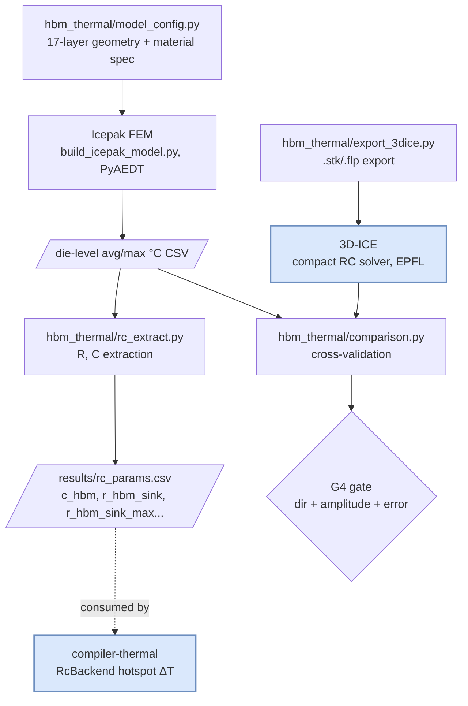

# HBM_build

A PyAEDT-scripted Ansys Icepak FEM thermal model of an HBM2E 8-Hi stack, built end-to-end
under an Ansys Student license (512K-element mesh ceiling, single-instance, no HPC). Cross-validated
against an independent open-source compact thermal solver (3D-ICE), extended to a 30 W high-power
regime, and exported as calibration parameters for a sibling GPU-compiler project's RC thermal model.

> This README documents the FEM/thermal-characterization project. For the downstream consumer — a
> GPU kernel-optimization loop that judges compiler transformations by simulated junction
> temperature — see [compiler-thermal](https://github.com/alexxony/compiler-thermal).

## Architecture



`hbm_thermal/` is pure Python (stdlib only, no `numpy`, no `pyaedt`) — geometry, material
homogenization, and RC extraction are unit-testable on any machine. Only `scripts/build_icepak_model.py`
and its Icepak-driving siblings need Windows + AEDT Student; everything downstream of a CSV (RC
extraction, 3D-ICE cross-validation, hypothesis tests) re-runs anywhere.

## Key results

| Phase | Result |
|---|---|
| **P1 — baseline + validation** | 8-Hi stack, 16 W, top-only cooling: base_die 114.7 / 122.2 °C (avg/max). Mesh convergence L1→L3 change ≤0.024% (`results/mesh_convergence.csv`). Independent cross-check against 3D-ICE: **0.004%** die-average error (`results/icepak_vs_3dice_comparison.csv`). Transient τ vs. lumped-RC analytic: **4.04%** deviation, R²=0.999996 PASS (`results/transient_tau_comparison.csv`). Parameter study (6 cases, `results/param_study.csv`) reproduces literature direction on 3 axes: stack height (4/8/12-Hi → 97.0/114.7/133.0 °C avg, MDPI), bonding resistance (µ-bump vs hybrid, AIP JAP), and top+bottom cooling (61.9 °C max vs 122.2 °C top-only, imec-style ~17 °C-class reduction pattern). |
| **P2 — RC parameter extraction** | Layer-cake homogenization → `c_hbm = 0.1240 J/K` (analytic, ρ·cp×volume identity). `r_hbm_sink` range **[0.929, 4.671] K/W** from two cooling-BC bracket cases. |
| **P3 — power-map granularity** | Splitting base_die's uniform 8.8 W into 3 patent-informed blocks (PHY/TSVA/DA) leaves the **average** unchanged (<0.001%, so `r_hbm_sink` is untouched) but the **hotspot** underestimates by up to **+19.5 K** under the uniform approximation — a quantified blind spot the average-temperature RC model cannot see. |
| **P4 — 30 W high-power regime** | Hotspot ΔT(S2−S0) scales **linearly** with power: 1.850× at 30 W vs. an expected 1.875× (=30/16) — H1a confirmed, within the pre-registered band. Bottom cooling suppresses the amplification by 14.1%. All A-series scenarios exceed the 95 °C junction spec by 100–135 K (top-only cooling alone is insufficient at 30 W). |
| **P5 — G4 root-cause split** | The P4 cross-validation gate (Icepak vs. 3D-ICE) failed for both cooling series — P5 separated *why*. **A-series (top-only): reconstructing the comparison on matching statistics (avg-vs-avg instead of max-vs-avg) gives 1.0137**, inside the [0.9, 1.1] PASS band — the original 0.8905 FAIL was a comparison-axis artifact, not a physics discrepancy. **B-series (top+bottom): FAIL persists even avg-vs-avg (0.7616)** — a genuine bottom-heatsink modeling gap in 3D-ICE, honestly reported and carried forward rather than papered over. Hotspot-resistance parameter (`r_hbm_sink_max`) formalized and extended to all 6 power-map × cooling-series cases at 30 W, confirming power-linearity (S1/S2 deviation ≈0.000%). |

## Negative results (not hidden)

- **G4 B-series cross-validation: FAIL**, confirmed a genuine physics gap rather than a
  comparison-axis bug (P5 T3, `results/p5_report.md` §2). 3D-ICE's bottom-heat-sink boundary
  condition under-suppresses ΔT relative to Icepak (damping ratio 0.199 measured vs. 0.435 in
  3D-ICE) — root-cause investigation is deferred as a P5+ candidate, not silently dropped.
- **Ansys Student license ceiling**: mesh convergence levels 4–5 were rejected outright
  (`ipk.analyze() returned False`, `results/mesh_convergence.csv`) — the 512K-element cap blocks
  finer mesh resolutions on this geometry. Convergence is established from levels 1–3 only.
- **`n_elements` never recovered**: `mesh_convergence.csv`'s `n_elements` column is empty across
  all 5 levels — the `export_mesh_stats()` parse path didn't yield a value in this AEDT version,
  so convergence is judged on temperature-change-percent alone, not on a directly confirmed element
  count.
- Several geometric assumptions (TSV pitch/diameter, µbump pitch, block width/power ratios for
  the P3 power map) are sourced from public patents and literature, not confirmed die-shot
  measurements — documented as sensitivity-sweep inputs, not single ground-truth values
  (`results/p3_report.md` §4).

## Downstream consumption

`results/rc_params.csv` (`r_hbm_sink`, `r_hbm_sink_max`, `r_hbm_sink_max_p4`) is imported by the
[compiler-thermal](https://github.com/alexxony/compiler-thermal) project's `RcBackend` to convert
measured GPU kernel power into a hotspot ΔT for its P10/P11 verification phases — a second,
independent axis on top of that project's own energy-based judgment. The hotspot-resistance sets
are power-map-scenario-dependent (not a single reusable scalar) but linear in absolute power, per
P5's H_T2 result above.

## Repository layout

```
hbm_thermal/            # pure-Python thermal model (stdlib only, no pyaedt/numpy)
  materials.py          # base material constants (Si, Cu, SiO2, solder, underfill, EMC)
  homogenize.py         # anisotropic effective-k homogenization (k_z mixing, k_xy Hasselman-Johnson)
  model_config.py        # 17-layer HBM2E 8-Hi geometry/material/power spec builder
  export_3dice.py        # .stk/.flp export for 3D-ICE cross-validation
  comparison.py           # Icepak-vs-3D-ICE die temperature comparison/gating
  convergence.py, tau_fit.py, param_study.py, rc_extract.py

scripts/                # Windows + AEDT Student entry points (PyAEDT)
  build_icepak_model.py  # core Icepak build+solve, --power-scenario / --bottom-htc flags
  mesh_convergence.py    # mesh resolution sweep (single-instance, reuses one Icepak session)
  param_study.py         # 6-case literature-direction parameter study
  cross_validate_3dice.py, extract_rc_params.py, extract_rc_hotspot.py
  p4_t4_run_3dice_sweep.py, p4_t4_crossval_hypotheses.py
  p5_t1_amplitude_recheck.py, p5_t3_bottomsink_avgavg.py

tests/                  # 12 files, 315 tests — all pure-logic, no AEDT required
results/                # CSVs + phase reports (p3_report.md, p4_report.md, p5_report.md, rc_params.csv)
docs/                   # run-on-windows.md (AEDT setup/troubleshooting), 3D-ICE cross-validation notes
```

## Running it

```bash
# pure-Python thermal model + all logic tests — no AEDT, runs anywhere
/usr/bin/python3 -m pytest tests/ -q
# 315 passed
```

The Icepak build/solve scripts require **Windows + Ansys Electronics Desktop (AEDT) Student**
(WSL/Linux cannot run AEDT); see [`docs/run-on-windows.md`](docs/run-on-windows.md) for setup,
the 512K-element Student mesh ceiling, and a troubleshooting log covering PyAEDT version
regressions, gRPC connection failures, and Windows console encoding traps hit during this project.
Everything downstream of a produced CSV — RC extraction, 3D-ICE cross-validation, hypothesis
tests — is pure Python and re-runs identically on WSL/Linux without AEDT.

```bash
# WSL/Linux — re-derive RC parameters or re-run 3D-ICE cross-validation from existing CSVs
python3 scripts/extract_rc_params.py --param-study-csv results/param_study.csv --output results/rc_params.csv
python3 scripts/cross_validate_3dice.py --3dice-bin <path-to-3D-ICE-Emulator> --icepak-csv <path> --output-dir results/
```

## License

MIT — see [LICENSE](LICENSE). Personal portfolio / research prototype.
