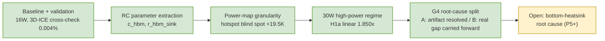

# HBM_build

> This README documents the FEM/thermal-characterization project. For the downstream consumer — a
> GPU kernel-optimization loop that judges compiler transformations by simulated junction
> temperature — see [compiler-thermal](https://github.com/alexxony/compiler-thermal).

## 1. What this is

A PyAEDT-scripted Ansys Icepak FEM simulation of an HBM2E 8-Hi memory stack, built end-to-end under
an Ansys Student license (512K-element mesh ceiling, single-instance, no HPC), cross-validated
against an independent open-source compact thermal solver (3D-ICE) and extended to a 30 W
high-power regime. Headline numbers: **0.004% die-average error** between the Icepak FEM and 3D-ICE
compact model at baseline (16 W, `results/icepak_vs_3dice_comparison.csv`); hotspot ΔT scales
**1.850×** at 30 W against an expected 1.875× linear extrapolation (`results/p4_report.md` §3); and
the pure-Python thermal model carries **315 passing logic tests**, no AEDT required
(`/usr/bin/python3 -m pytest tests/ -q`). The remaining findings are in section 4.

## 2. Why this is needed

FEM thermal simulation of packaged memory stacks is standard practice, but a single FEM run gives
one number with no way to tell whether it's right. The contribution here is not the FEM model
itself but the **discipline wrapped around it**: every claim is cross-checked against a second,
independently-implemented solver (3D-ICE, EPFL) rather than trusted on its own, mesh convergence is
verified rather than assumed, and results are extracted into a reduced RC parameter set
(`results/rc_params.csv`) that a downstream project can consume without re-running FEM.

That downstream project is [compiler-thermal](https://github.com/alexxony/compiler-thermal), a
GPU-compiler optimization loop that uses these RC parameters to convert measured kernel power into
a simulated hotspot ΔT for its own judgment gates. This repo is also a sibling of
[gpu-solver-loop](https://github.com/alexxony/gpu-solver-loop), the engine `compiler-thermal` forks
its optimization-loop mechanism from; hbm-build supplies the thermal calibration data that engine's
objective function consumes. All three independently follow the same discipline — controlled
before/after comparisons on one changed condition at a time, an append-only ledger recording every
run, and honest reporting of negative results — documented per repo (this repo: `JOURNAL.md` +
sections 4-5 below).

## 3. How it works



`hbm_thermal/` is pure Python (stdlib only, no `numpy`, no `pyaedt`) — geometry, material
homogenization, and RC extraction are unit-testable on any machine. Only
`scripts/build_icepak_model.py` and its Icepak-driving siblings need Windows + AEDT Student;
everything downstream of a CSV (RC extraction, 3D-ICE cross-validation, hypothesis tests) re-runs
anywhere.

### Repository layout

```
hbm_thermal/            # pure-Python thermal model (stdlib only, no pyaedt/numpy)
  materials.py          # base material constants (Si, Cu, SiO2, solder, underfill, EMC)
  homogenize.py         # anisotropic effective-k homogenization (k_z mixing, k_xy Hasselman-Johnson)
  model_config.py        # 17-layer HBM2E 8-Hi geometry/material/power spec builder
  export_3dice.py        # .stk/.flp export for 3D-ICE cross-validation
  comparison.py           # Icepak-vs-3D-ICE die temperature comparison/gating
  convergence.py, tau_fit.py, param_study.py, rc_extract.py

scripts/                # Windows + AEDT Student entry points (PyAEDT)
  build_icepak_model.py  # core Icepak build+solve, --power-scenario / --bottom-htc flags
  mesh_convergence.py    # mesh resolution sweep (single-instance, reuses one Icepak session)
  param_study.py         # 6-case literature-direction parameter study
  cross_validate_3dice.py, extract_rc_params.py, extract_rc_hotspot.py
  p4_t4_run_3dice_sweep.py, p4_t4_crossval_hypotheses.py
  p5_t1_amplitude_recheck.py, p5_t3_bottomsink_avgavg.py

tests/                  # 12 files, 315 tests — all pure-logic, no AEDT required
results/                # CSVs + phase reports (p3_report.md, p4_report.md, p5_report.md, rc_params.csv)
docs/                   # run-on-windows.md (AEDT setup/troubleshooting), 3D-ICE cross-validation notes
```

### Run

```bash
# pure-Python thermal model + all logic tests — no AEDT, runs anywhere
/usr/bin/python3 -m pytest tests/ -q
# 315 passed
```

The Icepak build/solve scripts require **Windows + Ansys Electronics Desktop (AEDT) Student**
(WSL/Linux cannot run AEDT); see [`docs/run-on-windows.md`](docs/run-on-windows.md) for setup,
the 512K-element Student mesh ceiling, and a troubleshooting log covering PyAEDT version
regressions, gRPC connection failures, and Windows console encoding traps hit during this project.
Everything downstream of a produced CSV — RC extraction, 3D-ICE cross-validation, hypothesis
tests — is pure Python and re-runs identically on WSL/Linux without AEDT.

```bash
# WSL/Linux — re-derive RC parameters or re-run 3D-ICE cross-validation from existing CSVs
python3 scripts/extract_rc_params.py --param-study-csv results/param_study.csv --output results/rc_params.csv
python3 scripts/cross_validate_3dice.py --3dice-bin <path-to-3D-ICE-Emulator> --icepak-csv <path> --output-dir results/
```

## 4. Evidence — where to look

| Finding | Result | Source |
|---|---|---|
| Baseline + validation | 8-Hi stack, 16 W, top-only cooling: base_die 114.7 / 122.2 °C (avg/max). Mesh convergence L1→L3 change ≤0.024%. Independent cross-check against 3D-ICE: **0.004%** die-average error. Transient τ vs. lumped-RC analytic: **4.04%** deviation, R²=0.999996 PASS. Parameter study (6 cases) reproduces literature direction on 3 axes: stack height (4/8/12-Hi → 97.0/114.7/133.0 °C avg, MDPI), bonding resistance (µ-bump vs hybrid, AIP JAP), and top+bottom cooling (61.9 °C max vs 122.2 °C top-only, imec-style ~17 °C-class reduction pattern). | `results/mesh_convergence.csv`, `results/icepak_vs_3dice_comparison.csv`, `results/transient_tau_comparison.csv`, `results/param_study.csv` |
| RC parameter extraction | Layer-cake homogenization → `c_hbm = 0.1240 J/K` (analytic, ρ·cp×volume identity). `r_hbm_sink` range **[0.929, 4.671] K/W** from two cooling-BC bracket cases. | `results/rc_params.csv` |
| Power-map granularity | Splitting base_die's uniform 8.8 W into 3 patent-informed blocks (PHY/TSVA/DA) leaves the **average** unchanged (<0.001%, so `r_hbm_sink` is untouched) but the **hotspot** underestimates by up to **+19.5 K** under the uniform approximation — a quantified blind spot the average-temperature RC model cannot see. | `results/p3_report.md` §2 |
| 30 W high-power regime | Hotspot ΔT(S2−S0) scales **linearly** with power: 1.850× at 30 W vs. an expected 1.875× (=30/16) — H1a confirmed, within the pre-registered band. Bottom cooling suppresses the amplification by 14.1%. All A-series scenarios exceed the 95 °C junction spec by 100–135 K (top-only cooling alone is insufficient at 30 W). | `results/p4_report.md` §3, §6 |
| G4 cross-validation root-cause split | The Icepak-vs-3D-ICE cross-validation gate failed for both cooling series at 30 W — root-cause analysis separated *why*, and the two series resolved differently (see below). Hotspot-resistance parameter (`r_hbm_sink_max`) formalized and extended to all 6 power-map × cooling-series cases at 30 W, confirming power-linearity (S1/S2 deviation ≈0.000%). | `results/p5_report.md` §1-2 |

**The G4 split is the methodological centerpiece of this repo — a worked example of distinguishing
a statistical artifact from a genuine physics gap by reconstruction, not by assumption.** Both series
initially failed cross-validation: A-series (top-only cooling) at an amplitude ratio of 0.8905
against a [0.9, 1.1] pass band, B-series (top+bottom cooling) at a mean-error of ~18-47%. The test
applied to both was identical — recompute the comparison on a matching statistic and see whether the
failure survives:

- **A-series: reconstructing the comparison on matching statistics (avg-vs-avg instead of the
  original max-vs-avg) gives 1.0137**, inside the PASS band. The original FAIL was a
  comparison-axis artifact — Icepak's max and 3D-ICE's avg were never comparable numbers, not a
  physics discrepancy.
- **B-series: FAIL persists even avg-vs-avg (0.7616)**, because that series' original comparison
  was already avg-vs-avg (`hbm_thermal/comparison.py:50-65`) — there is no reconstruction left to
  try. This is accepted as a genuine bottom-heatsink modeling gap in 3D-ICE (damping ratio 0.199
  measured in Icepak vs. 0.435 in 3D-ICE) and carried forward as an open problem, not papered over.

Applying the same reconstruction test to both series and getting two different answers is the
evidence that the method discriminates real effects from artifacts — it does not just rubber-stamp
whichever answer looks better. Full detail: `results/p5_report.md` §2, `JOURNAL.md`
2026-07-20T23:50:08 (A-series) and 2026-07-21T01:21:28 (B-series).

### Downstream consumption

`results/rc_params.csv` (`r_hbm_sink`, `r_hbm_sink_max`, `r_hbm_sink_max_p4`) is imported by the
[compiler-thermal](https://github.com/alexxony/compiler-thermal) project's `RcBackend` to convert
measured GPU kernel power into a hotspot ΔT for its own verification phases — a second, independent
axis on top of that project's own energy-based judgment. The hotspot-resistance sets are
power-map-scenario-dependent (not a single reusable scalar) but linear in absolute power, per the
power-linearity result above.

## 5. Limits / not proven

- **No physical measurement.** Validation here is simulation against simulation — the Icepak FEM
  cross-checked against the 3D-ICE compact model — not against a physical thermal camera or
  die-embedded sensor. Every number in this repo is a simulated temperature.
- **No die-shot ground truth.** Several geometric assumptions (TSV pitch/diameter, µ-bump pitch,
  block width/power ratios for the power map) are sourced from public patents and literature, not
  confirmed die-shot measurements. Citing the exact source for each is the safeguard here —
  documented as sensitivity-sweep inputs, not single ground-truth values (`results/p3_report.md`
  §4).
- **`n_elements` never recovered.** `mesh_convergence.csv`'s `n_elements` column is empty across all
  5 levels — the `export_mesh_stats()` parse path didn't yield a value in this AEDT version, so
  mesh convergence is judged on temperature-change-percent alone, not on a directly confirmed
  element count.
- **Mesh resolution capped by license, not by convergence.** Mesh convergence levels 4–5 were
  rejected outright by the solver (`ipk.analyze() returned False`, `results/mesh_convergence.csv`)
  — the Ansys Student 512K-element ceiling blocks finer mesh resolutions on this geometry.
  Convergence is established from levels 1–3 only.
- **B-series cross-validation gap is unresolved.** The G4 split above (section 4) is honest about
  this: the bottom-heatsink discrepancy between Icepak and 3D-ICE (0.7616, below the [0.9, 1.1]
  band) survived reconstruction and is carried forward as an open root-cause question, not
  silently dropped.

## 6. Status

Five phases complete: baseline validation and mesh convergence, RC parameter extraction,
power-map-granularity hotspot analysis, the 30 W high-power regime, and the G4 cross-validation
root-cause split (A-series resolved as artifact, B-series confirmed as a genuine gap and carried
forward). The bottom-heatsink root cause from the G4 split is the leading open item for further
work.



## License

MIT — see [LICENSE](LICENSE). Personal portfolio / research prototype.
